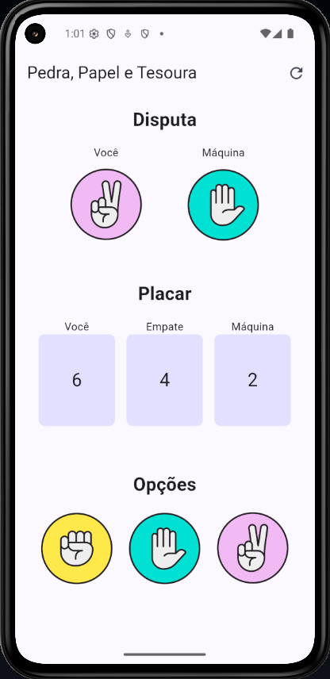

# Jokenpo App

Um aplicativo Flutter para jogar pedra, papel, tesoura contra a máquina.

## Matrícula dos Componentes da Dupla
- Eduardo Martins Cardoso
- Breno Tonini Costa

## Captura de Tela do Aplicativo


## Recursos
- Botões que selecionam a jogada desejada.
- A máquina joga automaticamente junto do jogador.
- Placar para exibir os resultados das jogadas.
- Botão de reiniciar placar.

## Instalação 
Siga os passos abaixo para rodar o projeto localmente:

1. Clone este repositório:
```sh
git clone https://github.com/BrenoTonini/jokenpo_app.git
```
2. Acesse a pasta do projeto:
```sh
cd jokenpo_app
```
3. Execute o app:
```sh
flutter run
```

## Tecnologias Utilizadas
- Flutter (Framework de UI)
- Dart (Linguagem de Programação)
- Material Design (Interface Moderna)

## Como Usar
- Selecione entre "Pedra", "Papel" e "Tesoura".
- Se divirta!

## Observações

- Este projeto é um exercício acadêmico de aplicativos mobile focado na introdução dos elementos básicos do Flutter, que são fundamentais para o desenvolvimento de interfaces de usuário eficientes e responsivas.
- Uso do componente **Image** e **GestureDetector** para criar uma interação entre o usuário e o aplicativo.
- **Row**, **Column**, **StatefulWidge**t e **StatelessWidget**

## Contribuição

Projeto acadêmico não aberto para contribuições externas. No entanto, sinta-se à vontade para clonar o repositório e realizar modificações para aprendizado pessoal.

---

Desenvolvido como parte da disciplina **Aplicativos Mobile - Faculdade UCL**.
